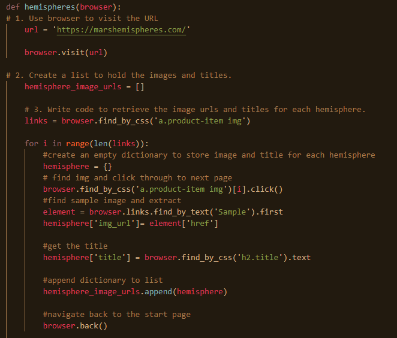
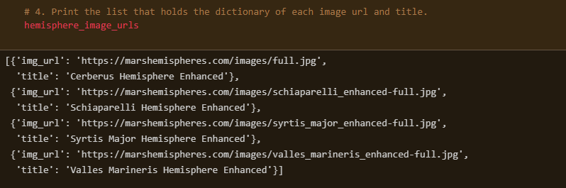
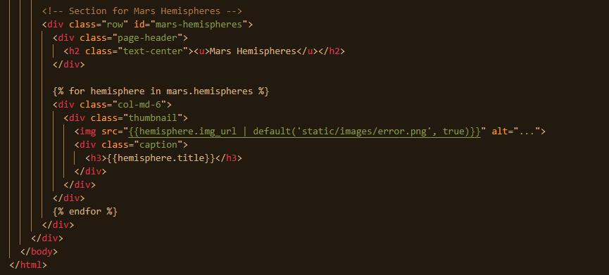

# Mission-to-Mars
Module 10
## Deliverable 1
 For Module 10 challenge Deliverable 1, we had to web scrape Full-Resolution Mars hemisphere images and titles that will be added to a web app that we created while working through module 10.  The snippet below is a function created in scraping.py that will iterate through 'Sample' images using a for loop and find_by_css to pull the image link and title and store it to a dictionary and then finally to a list be used later by the index.html file.
 
 * 
 
 Below is the output of the dictionary created to store the images and titles.
 
  * 
  
## Deliverable 2
 Our second deliverable for this project is to update the Web App with the Mars Hemisphere Images and Titles that we scraped during deliverable 1.  The screen shot below was pulled from the index file. It iterates through the images and titles captured during the web scraping steps and applies them to our web app.
 
  * 
  
## Deliverable 3

 Finally, we had to add Bootstrap 3 components to give our web app a bit of customization and styling.  The overall look of the app is pretty good as it is.  I am of the mindset that less is more.  However, for the sake of this exercise, I scanned the bootstrap website for options and here are some of the changes that I have made:
 * Underline the header lines
 * Made the header font bold
 * Changed the button from primary to warning to better match the colors displayed by the Mars hemisphere images
 * Changed the website title page to orangered to be a better aesthetic match when compared to the hemisphere images
 * Change the text font from regular to italics on the p tags for the body of the Mars news paragraph
 * used class="img-responsive" and alt= "Responsive image" along with col-md functionality to assist in view of web app across multiple device types.
